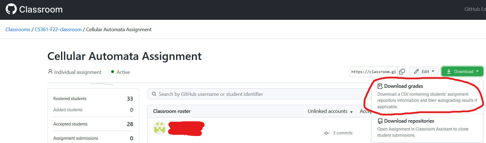

# CloneAllClasses
Process:

(Step 0. Ensure your SSH key is set up to not require a password with each use.)

Step 1. Download the grade csv from your Github Classroom, as seen below, and put it into your code folder

Step 2. Input the name of your csv into the input variable in CloneAll.py

Step 3. Input the path you want to save the repos to into the path variable in CloneAll.py

Step 4. Run CloneAll.py